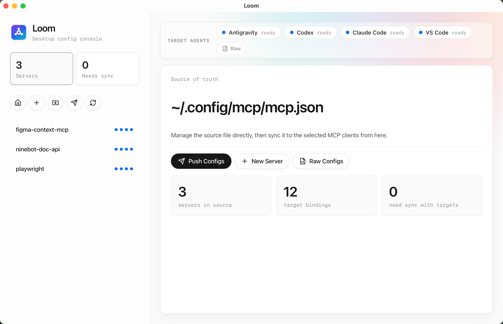

# Loom



一个本地桌面的 MCP（Model Context Protocol）服务器配置管理工具，使用 Tauri + Rust + React + TypeScript 构建。

## 这是什么

随着 AI 编程工具的普及，一台机器上往往会同时安装多个支持 MCP 的客户端（Claude Code、Codex、Antigravity、VS Code 等），每个客户端都有自己独立的 MCP 配置文件，格式各不相同（JSON、TOML…）。每新增或修改一个 MCP 服务器，就需要在多个文件之间反复同步，既繁琐又容易出错。

Loom 把这些客户端的配置统一收口到一个 **可编辑的源文件** 上，提供图形化界面来增删改 MCP 服务器，并一键同步到所有支持的客户端。

## 界面一览

- **左侧边栏**：服务器列表 + 高频操作工具条（Overview / New Server / Import JSON / Push / Refresh）。Import JSON 仅在此处入口，保持创作区干净。
- **主工作区**：Overview 总览（服务器数、目标绑定数、待同步数）与 Target Agents 状态行。
- **Target Agents 状态行**：每个客户端一个状态药丸，点击即可查看该客户端的原始配置文件；行末的 `Raw` 按钮可一次性查看全部原始配置。
- **编辑器**：选中服务器后在此编辑 command / args / env，并勾选要同步给哪些客户端。

## 它做了什么

- **统一管理入口**：通过 GUI 维护一份 MCP 服务器清单，免去手动编辑各客户端配置文件。
- **单一数据源**：所有配置以 `~/.config/mcp/mcp.json` 为唯一可信源，目标客户端文件只是同步产物。
- **一键多端同步**：把源文件中的服务器一次性下发到所有已支持的客户端配置。
- **按客户端分发**：每个服务器可以指定要同步给哪些客户端，未指定的默认同步给全部支持客户端。
- **cc-switch 联动**：在写入 cc-switch 时通过 SQLite 事务一并更新 settings、active provider 以及中央 `mcp_servers` 注册表，保证 CC Switch 中保存或切换时配置不丢失。

## 数据源

Loom 只维护一个用户可编辑的 MCP 源文件：

```text
~/.config/mcp/mcp.json
```

格式示例：

```json
{
  "mcpServers": {
    "context7": {
      "command": "npx",
      "args": ["-y", "@upstash/context7-mcp"],
      "env": {}
    }
  }
}
```

UI 与同步元数据保存在：

```text
~/.config/mcp-deck/state.json
```

## 支持的同步目标

- Antigravity：`~/.gemini/antigravity/mcp_config.json`
- Codex：`~/.codex/config.toml`
- Claude Code：`~/.claude.json`
- VS Code：`~/Library/Application Support/Code/User/mcp.json`

## 本地开发

```bash
npm install
npm run tauri dev
```

## 安全设计

- `~/.config/mcp/mcp.json` 是唯一可信源，目标客户端文件仅作为同步输出。
- 编辑已知 MCP 字段时会保留原有 JSON 中的其他服务器字段。
- Codex 的 TOML 使用 `toml_edit` 增量修改，保留注释和无关设置。
- 写入前会自动备份原文件，后缀为 `.mcp-deck.bak`。
- 一键同步会把源文件中的所有服务器写入各自的目标客户端；没有 Loom 元数据的服务器默认同步给所有支持的客户端。
- 与 cc-switch 的同步是显式触发的，并通过 SQLite 事务完成，同时更新 cc-switch 的 settings、active provider 以及中央 `mcp_servers` 注册表，确保在 CC Switch 中保存或切换时配置不会丢失。
